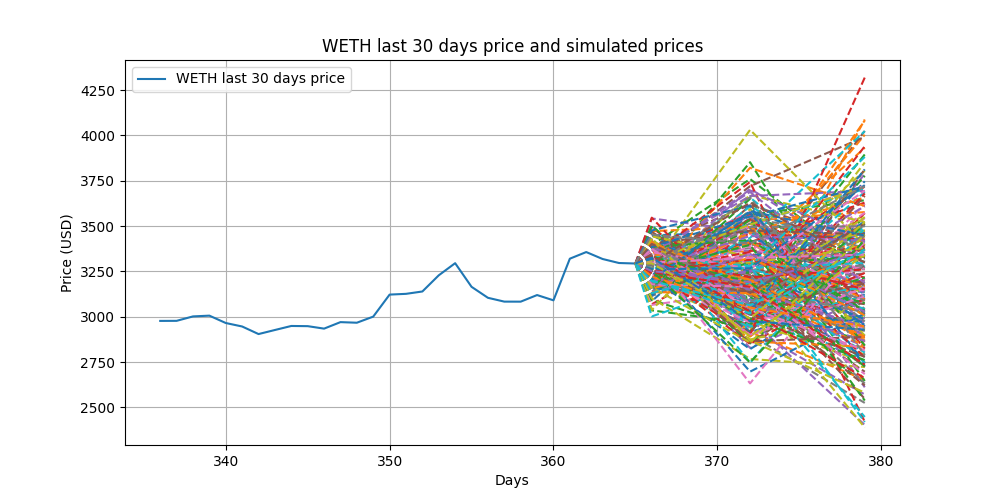
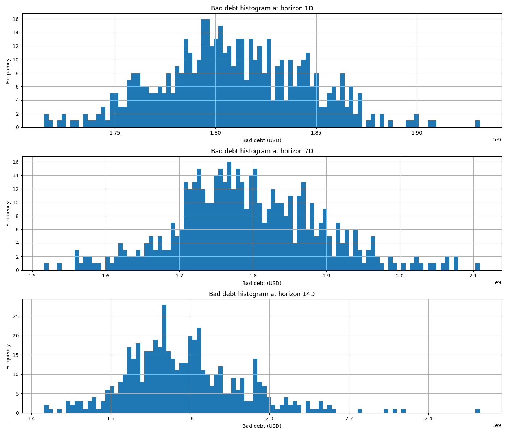

# Aave's Value-at-Risk Estimation

## Introduction
Aave is a leading decentralized lending protocol with over $30 billion in assets supplied, where a significant portion serves as collateral for variable-rate loans.

While borrow positions are over-collateralized, sudden and extreme market movements can dramatically impact loan-to-value (LTV) ratios, putting users at risk of liquidation—or worse, creating systemic risk for the entire Aave protocol.

This project aims to quantify potential protocol losses under extreme market conditions through rigorous Value-at-Risk (VaR) analysis.

## Data Sources
We leverage **The Graph** to collect comprehensive loan and deposit data, focusing on the top 1,000 borrow positions in Aave V3 on Ethereum Mainnet.

We use **CoinGecko** for historical daily price data spanning the last 365 days.

## VaR Calculation Methodology

### Price Volatility and Simulation
We begin by extracting price data for the top 10 markets (ranked by total deposit value) on Aave. Using a last 90-day window, we compute the mean and volatility of log returns, which form the foundation for Monte Carlo price simulations across multiple time horizons.

These simulations generate thousands of potential price trajectories, each representing a possible market scenario. Below is an example visualization showing historical prices alongside simulated trajectories over 1-day, 7-day, and 14-day horizons:



### Bad Debt and VaR
Value-at-Risk (VaR) represents the maximum expected loss for a portfolio over a given time horizon at a specific confidence level. For Aave, protocol losses manifest as **bad debt**—the aggregate value of under-collateralized loans that cannot be fully recovered through liquidation.

Bad debt is calculated as:

```
badDebt = Σ max(userDebt - userCollateral, 0)
```

For each simulated price trajectory, we compute the corresponding bad debt value, generating a comprehensive distribution of potential outcomes:



From this distribution, we extract VaR metrics at various confidence levels using percentile analysis. For instance, the **95% 1-day VaR** is approximately **$3.1 billion**, meaning there's a 5% probability that protocol losses could exceed this threshold within a single day.

## Running the Project

To execute the VaR simulation:

1. Create a `.env` file in the project root
2. Add your required API keys and configure environment variables
3. Run the simulation:

```bash
poetry run python src/vaarve/main.py
```